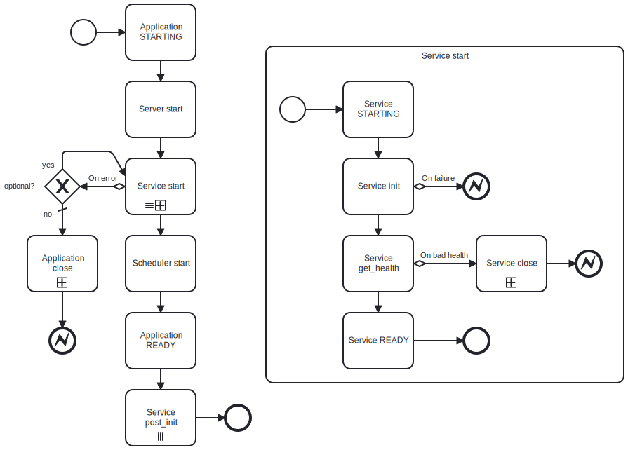

.. _app:

:tocdepth: 2

**app** - application and services
----------------------------------

:py:class:`~kaiju_app.app.Application` is the main executable which is supposed to be run by
:py:attr:`~kaiju_app.app.run_app` command inside an asyncio loop. An application contains a map of all services
in :py:class:`~kaiju_app.app.Application.services` and handles their initialization and termination.

There are also a few useful facilities provided by the app.

:py:class:`~kaiju_app.scheduler.Scheduler` is available at  :py:attr:`~kaiju_app.app.Application.scheduler` so you
can create periodic asyncio tasks with it. See :ref:`scheduler docs <scheduler>` for more info.

:py:class:`~kaiju_app.server.Server` is available at  :py:attr:`~kaiju_app.app.Application.server` which can be used
by RPC services to dynamically execute asyncio functions. See :ref:`server docs <server>` for more info.

You can also get and set context variables to create shared context between multiple services. Use
:py:meth:`~kaiju_app.app.Application.get_context_var` and :py:meth:`~kaiju_app.app.Application.set_context_var` for
this purpose.

.. image:: ../_static/img/application_diagram.svg
   :width: 600px
   :alt: application diagram
   :align: center

When an app is started, it initializes all the services by calling :py:meth:`~kaiju_app.app.Service.start`.
After the each service is ready the app will run services :py:meth:`~kaiju_app.app.Service.post_init`.
In case of an error the app will automatically terminate the services by calling :py:meth:`~kaiju_app.app.Service.stop`.

On start a service first switches to :py:attr:`~kaiju_app.app.ServiceState.STARTING`. Then the
:py:meth:`~kaiju_app.app.Service.init` is called and then the service health is determined by calling
:py:meth:`~kaiju_app.app.Service.get_health`. A developer should define both of those methods according to
inner service logic.

On stop a service switches to :py:attr:`~kaiju_app.app.ServiceState.CLOSING` and calls
:py:meth:`~kaiju_app.app.Service.close`. The latter should be once again defined by a developer of the service.

See the :ref:`service writing guide <guide_services>` for examples on how to create init methods for your own services.

.. autoclass:: kaiju_app.app.Application
   :members:
   :undoc-members:

.. autofunction:: kaiju_app.app.run_app

.. autoclass:: kaiju_app.app.Health
   :members:
   :undoc-members:

.. autoclass:: kaiju_app.app.Service
   :members:
   :undoc-members:

.. autofunction:: kaiju_app.app.service

.. autoclass:: kaiju_app.app.ServiceState
   :members:
   :undoc-members:

.. autoclass:: kaiju_app.app.ServiceInitFailed

.. autoclass:: kaiju_app.app.ServiceInitTimeout
